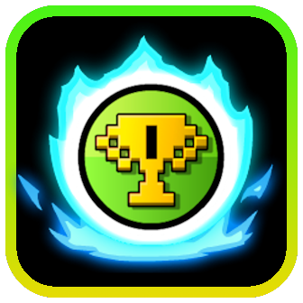
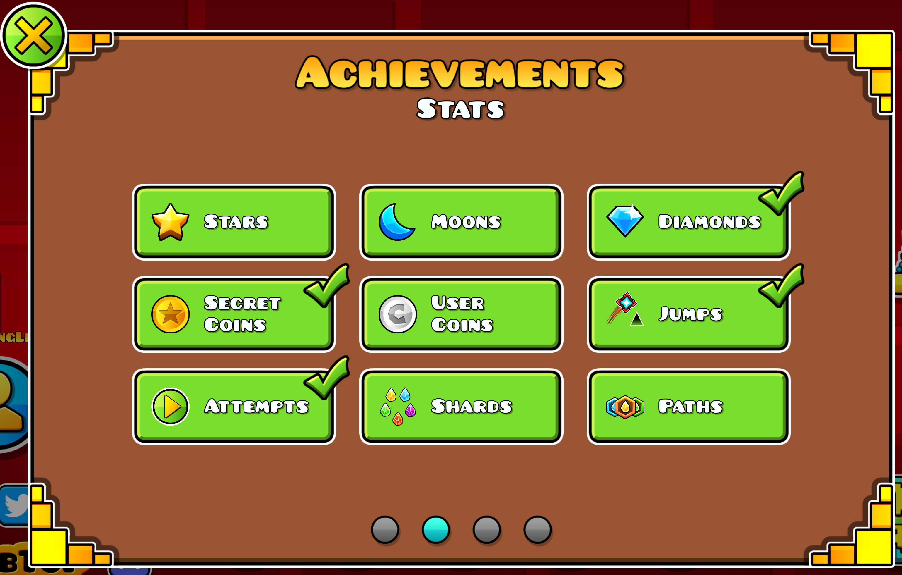
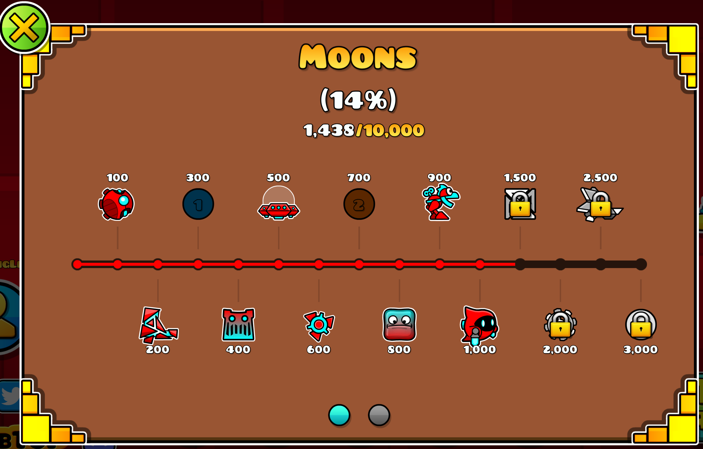

# Achievements Reimagined

This mod adds a brand new look to the achievements menu!

- No more clicking through 50 pages to find an achievement.
- All achievements are sorted into categories to make finding them easier.
- The achievements are displayed in a much nicer format.
- More helpful descriptions for completing some achievements.

# Credits

- GlowRock: For inspiration and coding help from your 'Better Unlock Progression' mod.
- GD Wiki: For better descriptions for many secret and vault achievements.

# Reporting Bugs

If you find any bugs or have a suggestion, please open an issue on [github](https://github.com/TheRisingLegend/achievements-reimagined) or message me on discord @kosmos6621.

# Previews

